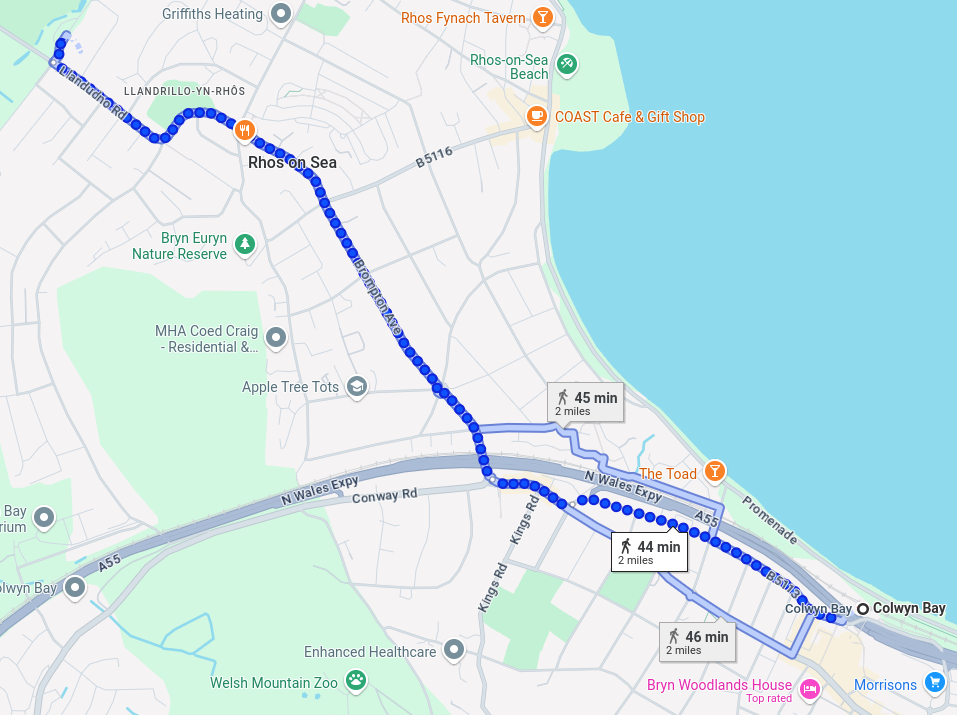
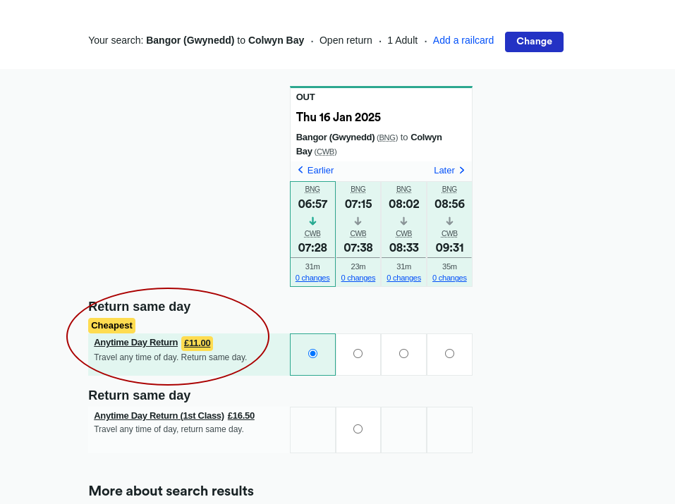

# What are Personal Learning Accounts?
The Personal Learning Account provides you with a way of accessing a wide range of **free and flexible training.**

These courses allow you to gain new skills and **qualifications** that employers want – helping you to progress in your current career or open up new job opportunities.

## Limitations
The courses are quite short (3-5 Days)

### Where can I use PLA Funding?
Colleges across Wales are offering courses through the Personal Learning Account:

- [Bridgend College](https://www.bridgend.ac.uk/part-time-study/personal-learning-accounts-pla)
- [Cardiff and Vale College](https://cavc.ac.uk/en/pla)
- [Coleg Cambria](https://www.cambria.ac.uk/personal-learning-account/)
- [Coleg Gwent](https://www.coleggwent.ac.uk/learning/part-time/personal-learning-accounts)
- [**Grŵp Llandrillo Menai**](https://www.gllm.ac.uk/personal-learning-account/)
- [Coleg Sir Gâr](https://www.colegsirgar.ac.uk/index.php/en/study/personal-learning-accounts)
- [Coleg y Cymoedd](https://www.cymoedd.ac.uk/employers/personal-learning-account-pla-core/)
- [Gower College Swansea](https://www.gcs.ac.uk/personal-learning-accounts)
- [The College Merthyr Tydfil](https://www.merthyr.ac.uk/en/employers/pla-s/)
- [Neath Port Talbot (NPTC) Group of colleges](https://www.nptcgroup.ac.uk/business/employersarea/personallearningaccounts/)
- [Pembrokeshire College](https://www.pembrokeshire.ac.uk/courses/personal-learning-accounts/)

Find all the approved qualifications across Wales and [search for courses](https://careerswales.gov.wales/course-search/results?proximity=5&courseType%5B%5D=267040001&order=titleAsc&groupSize=10&page=1).

## Am I eligible for PLA Funding?
To be eligible for training through the Personal Learning Account, you must meet at least one of the following criteria:
- **employed** (including self-employed), or
- on a zero hours contract, or
- agency staff, or
- **at risk of being made redundant**,
- and earning an annual basic salary under £32,371
- You also must be over the age of 19, live in Wales and be able to travel to the college venue, if required.

You are ineligible (at the point of application) if you are:
- under the age of 19, or
- attending school or college full-time as a pupil or student, or
- in full-time higher education, or
- in Welsh Government-funded work-based learning, or
- an ineligible overseas national, or
- in receipt of an Assembly Learning Grant or Education Maintenance Allowance, or
- unemployed i.e. does not have a contract of employment

### Note about available 
We now have a range of 'Digital' and 'Net Zero' courses available that have no maximum wage eligibility criteria.

### TL;DR
No, not without employment of some kind.

## Courses that show promise
The following courses look promising:

- [Cisco CCNA - Coleg Llandrillo](https://www.gllm.ac.uk/courses/cisco-ccna) (Rhos-on-Sea)
- [CompTIA CASP+](https://www.gllm.ac.uk/courses/comptia-casp) (Online)
- [CompTIA CySA+](https://www.gllm.ac.uk/courses/comptia-cysa) (Online)
- [CompTIA Network+](https://www.gllm.ac.uk/courses/comptia-network) (Online)
- [CompTIA Security+](https://www.gllm.ac.uk/courses/comptia-security) (Online)
- [CompTIA A+](https://www.gllm.ac.uk/courses/comptia-a) (Online)  See [Skills Bootcamps](../../Jobseeking/Training/Skills%20Bootcamps.md)
- [AWS Cloud Practitioner](https://www.gllm.ac.uk/courses/aws-cloud-practitioner) (Online)
- [AWS Solutions Architect Associate](https://www.gllm.ac.uk/courses/aws-solutions-architect-associate) (Online)

### Note about courses
Some of the courses above have downsides as well as being national qualifications, The CCNA Course, for example, is in Rhos-on-Sea, this would cost £11 per day for trains and would involve 4 miles of hiking each day, See Fig 1 and Fig 2 Below

