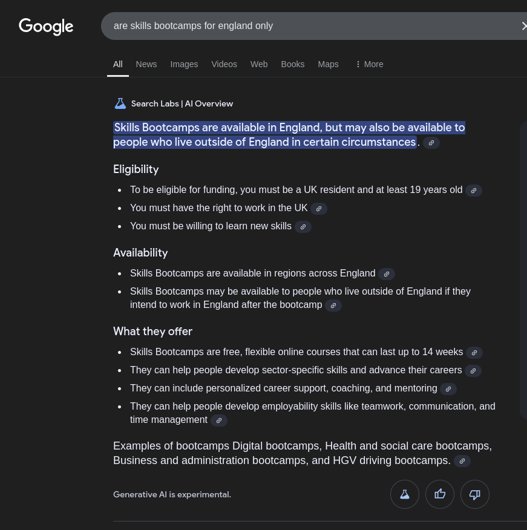

# What are Skills Bootcamps?
Skills Bootcamps are flexible training courses for adults aged 19 and over. They last up to 16 weeks and offer participants a job interview on completion. 

There are hundreds of courses in a range of sectors, including:
- digital skills, such as digital marketing, software development, data engineering and coding   
- technical skills, such as construction, logistics (HGV driving), engineering and manufacturing   
- skills that support the green economy, such as electric vehicles, heat pump technology, solar energy and agriculture technology

## How to find one
Skills Bootcamps can take place at a **college**, **another training provider** or **online**.
*You can find the right Skills Bootcamp for you through the [National Careers Service](https://nationalcareers.service.gov.uk/find-a-course/page?searchTerm=&distance=10%20miles&town=&orderByValue=Relevance&startDate=Anytime&courseType=Skills%20Bootcamp&sectors=&learningMethod=&courseHours=&courseStudyTime=&filterA=true&page=1&D=0)

## Ok so why?
After you’ve finished your Skills Bootcamp, you’re guaranteed a job interview with an employer.
You could:
- get a new job or apprenticeship
- progress in your current job
- find new business opportunities if you're self-employed
- **<abbr title="Jobcentre Plus">JCP</abbr> have asked me to look for work and I'm a little rusty

# Requirements

- Digital Education Sector
- Ideally with a recognised outcome (national certification)
- Something either similar or adjacent to web development / Software Development
	- ideas include:
		- [IT Technician Skills Bootcamps - JustIT](https://www.justit.co.uk/candidates/training-programmes/it-technician-skills-bootcamps/)
		- [Data Analysis with Python - PurpleBeard](https://purplebeard.co.uk/programmes/bootcamps/data-analysis-with-python)